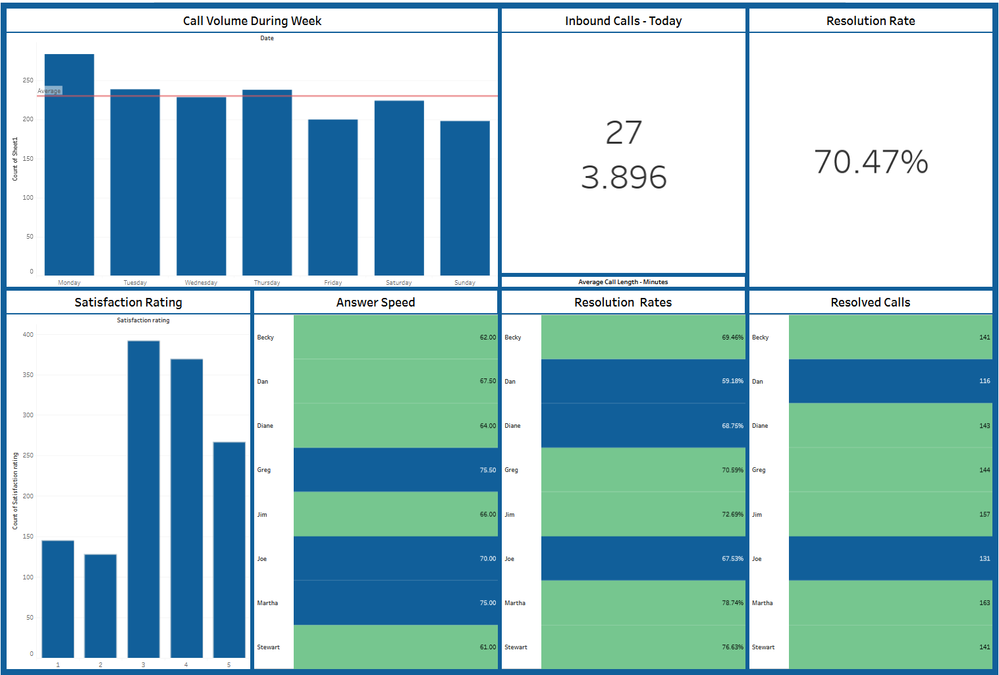

# 🎛 Help Desk KPI Dashboard – Tableau

---

## 📌 Project Overview

This project explores monthly help desk performance using Tableau. It focuses on resolution efficiency, support load, and agent-level trends. The dashboard is designed to provide HR and IT managers with at-a-glance insight into team workload and service delivery.

The data was pre-structured, allowing a focus on dashboard layout, interactivity, and stakeholder clarity.

**Live Dashboard:**  
🔗 [View in Tableau Public](https://public.tableau.com/app/profile/mitchell.rogers/viz/Help_Desk_KPI_Dashboard/MonthlyDashboard)

---

## 🎯 Business Objective

Help desk managers need visibility into:
- Average ticket resolution time
- Monthly open/closed ticket trends
- Agent performance by volume and resolution
- Common request categories and patterns

---

## 📊 Dashboard Features

- KPI cards for **Avg Resolution Time**, **Open/Closed Ticket Count**, and **Total Tickets**
- Monthly trends shown via bar and line charts grouped by **Status** and **Category**
- Breakdown by **Agent**, **Category**, and **Request Type**

> 📸 Example: Tableau Dashboard Overview  
> 

---

## 🛠 Tools & Skills Demonstrated

- **Tableau**: KPI visuals, bar/line charts, layout formatting
- **Data Design**: Clean metric labelling and layout for executive consumption
- **Visual Communication**: Prioritising usability and readability over raw technical depth

---

## 📂 Files Included

| File | Description |
|------|-------------|
| _Hosted in Tableau Public_ | This repo documents the project and links to the interactive dashboard |

---

## 📬 Contact

📧 mitchellrogers.uk+github@gmail.com  
🔗 [Back to Portfolio](https://mjr-portfolio.github.io/mjr_analyst_portfolio.github.io/)
